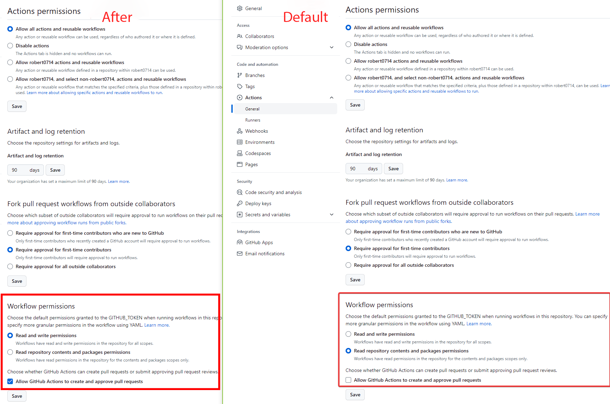

# Quick Start

Build application image and start all services with docker-compose
```bash
docker-compose build
docker-compose up -d
```

# Github Actions Setting
  
* https://docs.github.com/en/packages/working-with-a-github-packages-registry/working-with-the-docker-registry
* https://docs.github.com/en/packages/working-with-a-github-packages-registry/working-with-the-container-registry
* https://docs.github.com/en/packages/learn-github-packages/configuring-a-packages-access-control-and-visibility
* https://docs.github.com/en/packages/learn-github-packages/connecting-a-repository-to-a-package
* https://docs.github.com/en/packages/working-with-a-github-packages-registry/migrating-to-the-container-registry-from-the-docker-registry
* https://docs.github.com/en/packages/learn-github-packages/configuring-a-packages-access-control-and-visibility#ensuring-workflow-access-to-your-package

# ABC-MSA containers
The following are the services we have previously identified for our ABC-MSA system:

* API Gateway
* A frontend web dashboard interface
* Customer Management
* Product Management
* Order Management
* Inventory Management
* Courier Management
* Shipping Management
* Payment Authorization
* Notification Management
* Aggregator: “Product Ordered Qty”
* Management and Orchestration

## API Gateway
Many open source and commercial API gateways can be pulled from different internet repositories, including Tyk, API Umbrella, WSO2, Apiman, Kong, and Fusio, to name a few. We will use Tyk in our ABC-MSA system since it is easy to use, has comprehensive features including authentication and service discovery, and is 100% an open source product with no feature restrictions.

To install a Tyk Docker container, just follow the instructions at https://tyk.io/docs/tyk-oss/ce-docker/.

By default, the Tyk API gateway listens to TCP port 8080. To verify your installation, issue an API call test to Tyk using the curl command, as follows:
```bash
$ curl localhost:8080/hello
{"status":"pass","version":"4.1.0","description":"Tyk GW"}
```

## The frontend web dashboard interface
The dashboard is the main component of the **user interface (UI)** interaction and interacts with all services offered to the user. In our ABC-MSA example, we created a simple cart application where the user can place products in the cart and place an order.


## The Customer Management microservice as an example
The following command will allow you to connect to the container’s bash shell using the root privilege (a user ID of 0, as specified in the command):
```bash
$ docker exec -u 0 -it customer_management_container bash
```